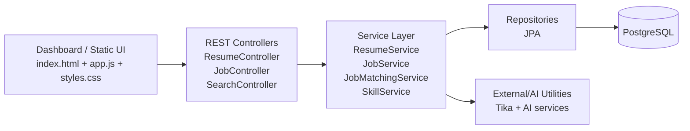
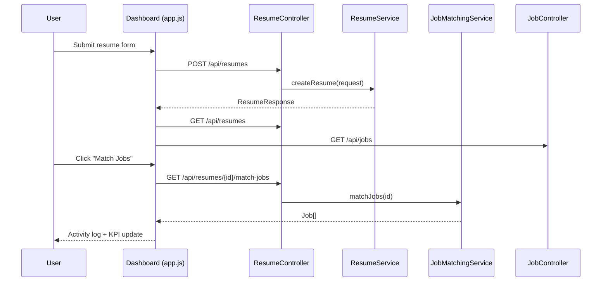

# AI Job Platform

AI Job Platform is a Spring Boot application with a built-in dashboard that parses resumes, extracts skills, and matches candidates to job descriptions.

## What was improved in this update

- Fixed a frontend sync/reliability bug where `/api/jobs` failures were silently ignored during refresh, which could make KPI data stale. The dashboard now uses the same API error handling flow for jobs and resumes.
- Fixed a frontend security bug (XSS risk) by escaping resume fields before rendering them into `innerHTML`.
- Refreshed the UI with a modern 2026-style palette (mint + periwinkle + peach on deep night background) and improved button states for clarity/accessibility.
- Expanded this README with architecture diagrams, execution flow, local run instructions, and end-to-end verification steps.

---

## Features

- Resume CRUD-style API (create/list/get/delete)
- Resume file upload and text parsing via Apache Tika
- Job creation/listing API
- Resume-to-job matching endpoint
- Skill extraction and vector-search-ready services
- Built-in dashboard served by Spring Boot static resources

---

## Tech Stack

- **Backend:** Java 17, Spring Boot 3, Spring Web, Spring Data JPA, Bean Validation
- **DB:** PostgreSQL (runtime), H2 (tests)
- **AI/Parsing utilities:** Apache Tika, embedding/vector service scaffolding
- **Frontend:** Vanilla HTML/CSS/JS served from `src/main/resources/static`
- **Build/Test:** Maven Wrapper + JUnit/Spring Boot Test

---

## Architecture Graph



---

## Request Flow (Resume → Match)



---

## Color System (Updated)

The dashboard now uses a trending, soft-neon palette:

- `--bg`: `#06070f`
- `--accent` (mint): `#7df8d3`
- `--accent2` (periwinkle): `#8f9bff`
- `--accent3` (peach): `#ffc6a6`
- balanced with cool glass surfaces and high-contrast text.

---

## Run Locally

### 1) Prerequisites

- Java 17+
- Maven 3.9+ (or use `./mvnw`)
- PostgreSQL running locally

### 2) Configure database

Update `src/main/resources/application.properties` or configure env overrides so these values are valid for your machine:

- `spring.datasource.url`
- `spring.datasource.username`
- `spring.datasource.password`

### 3) Start backend + frontend together

The frontend is bundled inside the same Spring Boot app, so one process runs both:

```bash
mvn spring-boot:run
```

Then open:

- Dashboard: `http://localhost:8080/`
- API docs (if enabled): `http://localhost:8080/swagger-ui/index.html`

---

## How to test frontend and backend together (sync checks)

Use this checklist to validate end-to-end behavior:

1. Open dashboard in browser.
2. Create one resume from **Add Resume** form.
3. Create one job from **Add Job** form.
4. Click **Refresh** and confirm KPI counts reflect created entities.
5. Click **Match Jobs** on a resume card.
6. Confirm activity log shows a successful match message.
7. Force an API error (e.g., stop backend and click Refresh) and verify UI shows a failure log entry rather than silently failing.

### API smoke checks (optional via curl)

```bash
curl -s http://localhost:8080/api/resumes
curl -s http://localhost:8080/api/jobs
curl -s -X POST http://localhost:8080/api/jobs \
  -H 'Content-Type: application/json' \
  -d '{"title":"Backend Engineer","description":"Java Spring Boot"}'
```

---

## Automated Tests

Run unit/integration-oriented backend tests:

```bash
mvn test
```

If using Maven wrapper:

```bash
./mvnw test
```

---

## Known environment caveats

- If Maven Central/network access is restricted, dependency resolution can fail before tests execute.
- `./mvnw` may need permission to download Maven distribution the first time it runs.

---

## Project Structure

```text
src/main/java/com/dinesh/ai_job_platform
├── controller
├── service
├── repository
├── model
├── dto
└── exception

src/main/resources
├── application.properties
└── static
    ├── index.html
    ├── styles.css
    └── app.js
```

---

## Future Improvements

- Add containerized local stack (`docker-compose`) for DB + app.
- Add Playwright/Cypress E2E tests for dashboard behavior.
- Add observability (health/readiness dashboard, metrics, traces).
- Add role-based auth for recruiter/admin workflows.
